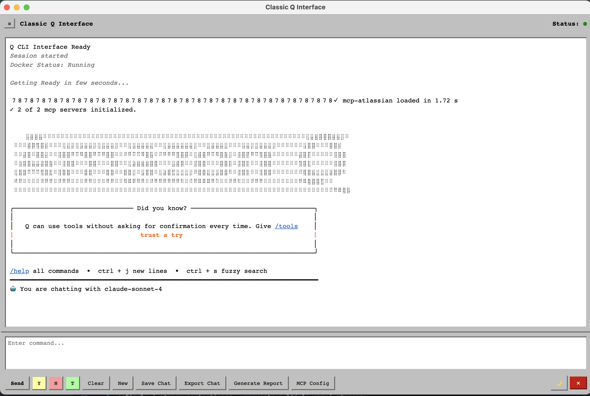
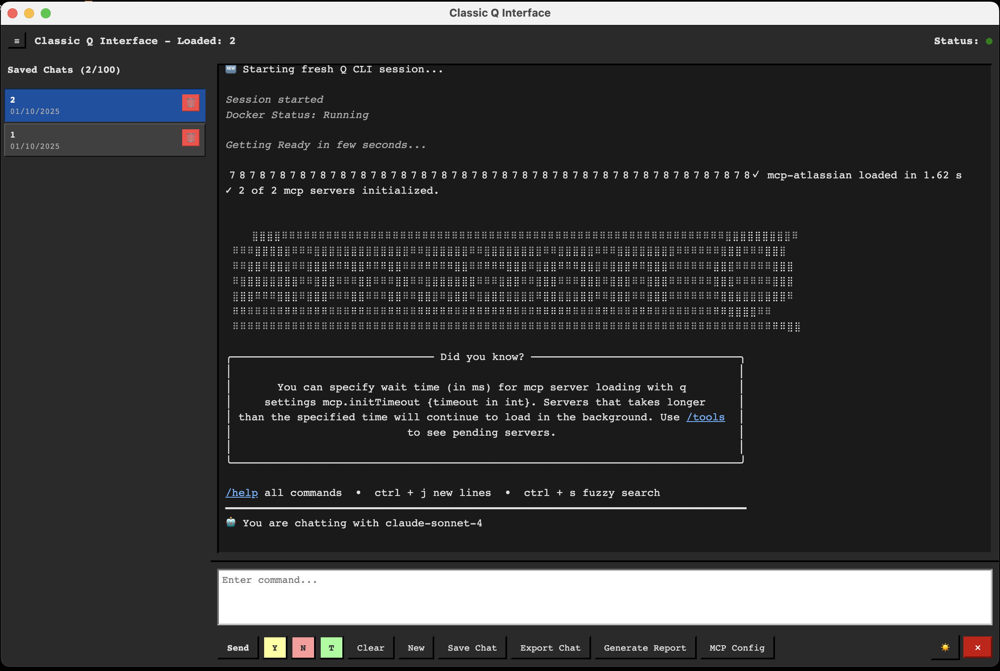
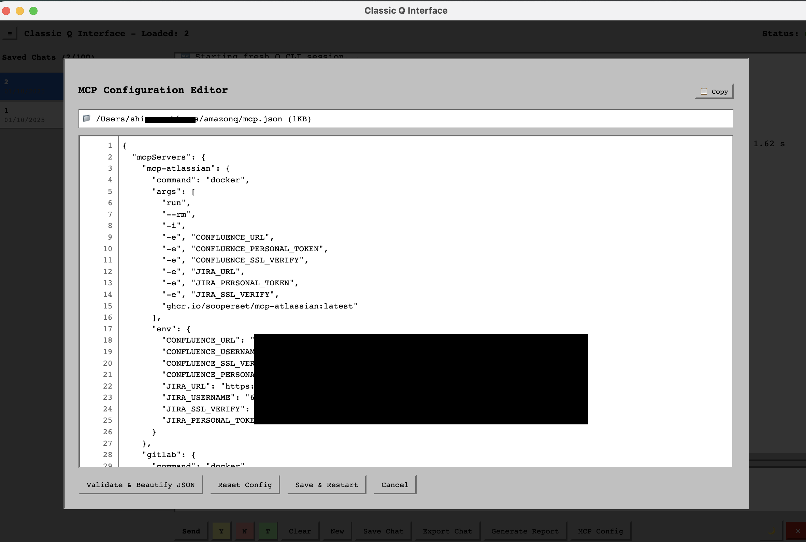
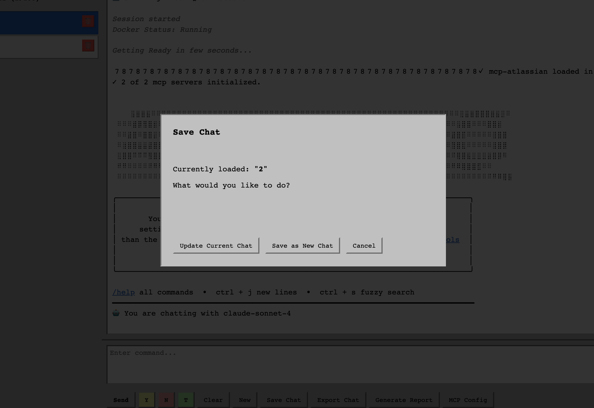
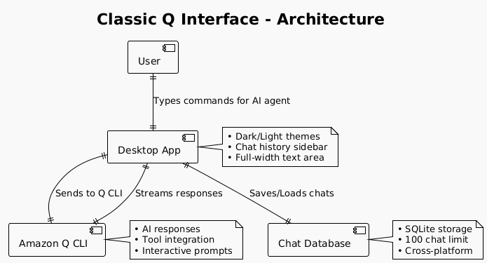
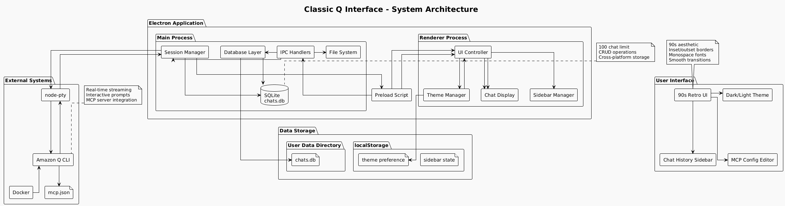

# Classic Q Interface

A nostalgic 90s-themed desktop application that brings classic computing aesthetics to modern AI interactions through Amazon Q CLI, featuring retro UI elements, monospace fonts, vintage button styling, and modern conveniences like dark mode and persistent chat history.

## Screenshots


*Main interface showing the retro 90s chat window with collapsible sidebar*


*Dark mode with authentic 90s terminal aesthetics*
sidebar displaying saved chat history with delete options*


*Built-in MCP configuration editor with JSON validation and dark mode support*


*Clean save chat dialog for organizing conversations*


## Features

### Core Functionality
- **Real-time Q CLI integration** with streaming output and proper terminal emulation
- **Interactive prompts handling** - automatic detection and response to y/n/trust prompts
- **File path linking** - click file paths in output to open files/directories
- **Session management** - create, manage, and terminate Q CLI sessions
- **Cross-platform support** (macOS, Windows, Linux) with platform-specific optimizations
- **Single instance protection** - prevents multiple app instances

### Chat History & Persistence
- **SQLite-based chat storage** - persistent local database for saved conversations
- **Smart save system** - update existing chats or save as new conversations
- **Visual chat selection** - sidebar highlighting of currently loaded chat
- **Chat management** - delete conversations with confirmation dialogs using 🗑️ buttons
- **100 chat limit** - prevents database bloat with automatic limit enforcement
- **Instant chat loading** - display saved conversations for manual context reference
- **Collapsible sidebar** - starts collapsed, expands on demand for clean interface

### MCP (Model Context Protocol) Support
- **MCP Configuration Editor** - built-in editor for `~/.aws/amazonq/mcp.json`
- **Automatic MCP server detection** - comprehensive PATH resolution for MCP servers
- **Docker integration** - automatic Docker path detection for containerized MCP servers
- **Configuration backup** - automatic backup creation when saving MCP configs
- **Real-time config validation** - JSON syntax validation before saving
- **Template reset** - one-click template configuration for quick setup
- **Copy configuration** - 📋 button to copy entire JSON config to clipboard

### UI/UX Enhancements
- **90s retro styling** - authentic vintage computing aesthetics with inset/outset borders
- **Dark/Light mode toggle** - 🌙/☀️ button with smooth transitions and persistent preference
- **Stacked layout design** - full-width text area with button footer for optimal typing experience
- **Responsive design** - adapts to different window sizes with resizable sidebar
- **Text selection & copy** - full copy support in chat output with Ctrl+C and right-click
- **Keyboard shortcuts** - Ctrl/Cmd+Enter to send messages
- **Auto-scrolling output** - automatically scrolls to latest output
- **Visual feedback** - hover effects, button states, and loading indicators

### Advanced Features
- **Smart terminal emulation** - uses node-pty when available, falls back to child_process
- **Comprehensive error handling** - detailed error reporting and troubleshooting guidance
- **File system operations** - read files, browse directories, open external applications
- **Export functionality** - save conversations and generate HTML reports
- **Developer tools** - Available in development builds only for security
- **Theme persistence** - remembers dark/light mode preference across sessions

## Prerequisites

- Node.js 16+
- Amazon Q CLI installed and configured
- SQLite3 (automatically installed via npm)

## Quick Start

```bash
# Install dependencies
npm install

# Run in development mode
npm run dev

# Build for production
npm run build
```

## Usage

### Basic Chat Operations
1. Type commands in the full-width textarea
2. Use `Ctrl+Enter` (or `Cmd+Enter` on Mac) to send
3. Click Y/N/Trust buttons for interactive prompts
4. Click file paths in output to open them
5. Select and copy text from chat output using Ctrl+C or right-click

### Theme Switching
*Dark and light mode toggle with 90s aesthetics*

1. **Toggle Theme**: Click 🌙 button to switch to dark mode
2. **Persistent Preference**: Theme choice is remembered across app restarts
3. **Smooth Transitions**: Colors fade smoothly between light and dark modes
4. **Complete Coverage**: All dialogs, modals, and UI elements support both themes

### Chat History Management
*Managing saved conversations in the collapsible sidebar*

1. **Expand Sidebar**: Click ≡ button to show/hide chat history
2. **Save Chat**: Click "Save Chat" button (requires 200+ characters)
3. **Load Chat**: Click any saved chat in left sidebar to display history
4. **Update Chat**: When chat is loaded, save updates existing conversation
5. **Delete Chat**: Click 🗑️ button next to any saved chat with confirmation
6. **New Session**: Click "New" to start fresh conversation and clear loaded state

### MCP Configuration
*Editing MCP server configuration with built-in editor and dark mode*

1. Click "MCP Config" button to open editor
2. Edit JSON configuration with syntax highlighting and line numbers
3. Use "Reset Config" for Atlassian MCP server template
4. Use 📋 "Copy" button to copy entire configuration
5. "Validate & Beautify" to format and check JSON syntax
6. "Save & Restart" to apply changes with automatic backup

### Export & Reports
1. **Export Chat**: Save current conversation as HTML file
2. **Generate Report**: Create AI-powered analysis report
3. **Copy Config**: Use 📋 button in MCP editor to copy configuration

## Building Releases

```bash
# Build for current platform
npm run build

# Build for specific platforms
npm run build-mac    # macOS DMG
npm run build-win    # Windows EXE
npm run build-linux  # Linux AppImage
```

## Data Storage

### Chat Database Location
- **macOS**: `~/Library/Application Support/Classic Q Interface/chats.db`
- **Windows**: `%APPDATA%/Classic Q Interface/chats.db`
- **Linux**: `~/.config/Classic Q Interface/chats.db`

### MCP Configuration
- **Location**: `~/.aws/amazonq/mcp.json`
- **Backup**: Automatic backups created on save
- **Template**: Built-in Atlassian MCP server template

### Theme Preferences
- **Storage**: localStorage in browser context
- **Persistence**: Survives app restarts and updates
- **Default**: Light mode on first launch

## Architecture



### Detailed System Architecture


### Technology Stack
- **Frontend**: HTML/CSS/JavaScript with 90s retro styling and CSS variables for theming
- **Backend**: Electron main process with IPC communication
- **Database**: SQLite3 for persistent chat storage with CRUD operations
- **Terminal**: node-pty for pseudo-terminal emulation with child_process fallback
- **Build**: electron-builder for cross-platform packaging with native module support

### Key Components
- **Main Process**: Session management, database operations, file system access, single instance control
- **Renderer Process**: UI interactions, chat display, user input handling, theme management
- **Preload Script**: Secure IPC bridge between main and renderer processes
- **Database Layer**: SQLite operations for chat CRUD with 100-item limit enforcement
- **Theme System**: CSS variables with smooth transitions and localStorage persistence

## Contributing

1. Fork the repository
2. Create a feature branch: `git checkout -b feature-name`
3. Make your changes and test locally
4. Commit: `git commit -m "Add feature"`
5. Push: `git push origin feature-name`
6. Create a Pull Request

## Automated Releases

GitHub Actions automatically builds installers for all platforms when you:
- Push a new tag: `git tag v1.0.0 && git push origin v1.0.0`
- Installers are attached to the GitHub release page

## Troubleshooting

### Common Issues
- **Q CLI not found**: Ensure Amazon Q CLI is installed and in system PATH
- **Database errors**: Check file permissions in user data directory
- **MCP server failures**: Verify Docker is running for containerized servers
- **Build failures**: Run `npm install` to ensure all dependencies are installed
- **Theme not persisting**: Check localStorage permissions and browser settings

### Debug Mode
- Available in development builds only for security
- Check console output for Q CLI errors
- Verify Q CLI output in terminal logs
- Use browser developer tools in development mode

## License

MIT License - see [LICENSE](LICENSE) file for details.

## Support

- Check console output for Q CLI errors
- Ensure Q CLI is in your system PATH
- Verify AWS credentials are configured
- For chat history issues, check database file permissions
- For theme issues, clear localStorage and restart app
